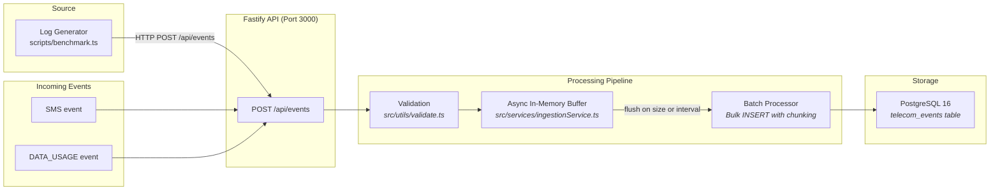

# Telecom Log Ingestion Service

A high-throughput, batch-oriented ingestion pipeline for telecom SMS and mobile data usage events. Built with Node.js, Fastify, TypeScript, and PostgreSQL — deployed via Docker Compose.

## Overview

This service accepts telecom event logs over HTTP, validates them, buffers them in memory, and writes them to PostgreSQL in configurable batches. It is designed for **throughput** (52K+ events/sec on a local Docker setup) while keeping API latency low through asynchronous buffering.

### Key capabilities

- **HTTP ingestion** of single events or batches (`POST /api/events`)
- **Runtime type validation** — SMS and DATA_USAGE events are checked before storage
- **Async in-memory buffering** — the API returns `202 Accepted` immediately; inserts happen in the background
- **Configurable batching** — flush by event count (`BATCH_SIZE`) or time (`BATCH_INTERVAL_MS`)
- **Bulk PostgreSQL inserts** — each batch becomes a single `INSERT ... ON CONFLICT DO NOTHING`
- **Idempotent ingestion** — duplicate `event_id` values are silently dropped
- **PostgreSQL parameter-limit handling** — large batches are automatically chunked to stay under the 65,535-parameter limit
- **Dockerised** — one-command startup with automatic schema initialization
- **Tested** — 19 unit/integration tests using an in-memory PostgreSQL emulator

## Tech Stack

| Category | Technology |
|---|---|
| Runtime | Node.js 20 |
| Framework | Fastify 5 |
| Language | TypeScript 5 |
| Database | PostgreSQL 16 |
| Containerisation | Docker Compose |
| Testing | Vitest + pg-mem (in-memory PostgreSQL) |
| Logging | Pino |

## Architecture



*(Rendered as a diagram on GitHub/GitLab — if your viewer doesn't support Mermaid, see the request flow below.)*

**Request flow:**

1. A producer (log generator, benchmark, or external system) sends events to `POST /api/events`
2. Fastify accepts both `SMS` and `DATA_USAGE` event types
3. Each event is validated against its type schema (runtime type guards)
4. Valid events are pushed into an in-memory async buffer
5. The buffer flushes on a size threshold (`BATCH_SIZE`) or time interval (`BATCH_INTERVAL_MS` — whichever comes first)
6. Each flush batch is chunked if necessary and bulk-inserted into PostgreSQL
7. Duplicates are silently ignored via `ON CONFLICT DO NOTHING`

## API

### `GET /health`

Service and database liveness check.

```bash
curl localhost:3000/health
```

Response `200 OK`:

```json
{ "status": "ok", "database": "ok" }
```

### `POST /api/events`

Accepts a single event, a batch object (`{"events": [...]}`), or a JSON array.

**Single SMS event:**

```bash
curl -X POST localhost:3000/api/events \
  -H 'Content-Type: application/json' \
  -d '{
    "eventId": "sms-001",
    "eventType": "SMS",
    "timestamp": "2026-09-17T10:00:00.000Z",
    "subscriberId": "S1234567A",
    "sourceNumber": "+6591234567",
    "destinationNumber": "+6587654321",
    "messageSize": 120,
    "status": "DELIVERED"
  }'
```

**Batch of events:**

```bash
curl -X POST localhost:3000/api/events \
  -H 'Content-Type: application/json' \
  -d '{
    "events": [
      { "eventId": "sms-002", "eventType": "SMS", "timestamp": "2026-09-17T10:00:01.000Z", "subscriberId": "S1234567A", "sourceNumber": "+6591234567", "destinationNumber": "+6587654321", "messageSize": 95, "status": "DELIVERED" },
      { "eventId": "bmd-001", "eventType": "DATA_USAGE", "timestamp": "2026-09-17T10:00:02.000Z", "subscriberId": "S1234567A", "bytesUsed": 1048576, "networkType": "5G" }
    ]
  }'
```

Response `202 Accepted`:

```json
{ "accepted": 2 }
```

## Database Design

The `telecom_events` table uses a **hybrid schema** — common query fields as dedicated columns, event-specific fields in JSONB.

| Column | Type | Purpose |
|---|---|---|
| `id` | `SERIAL PK` | Internal auto-increment primary key |
| `event_id` | `TEXT UNIQUE` | Business event identifier — used for idempotency |
| `event_type` | `TEXT` | `"SMS"` or `"DATA_USAGE"` |
| `timestamp` | `TIMESTAMPTZ` | Event occurrence time |
| `subscriber_id` | `TEXT` | Subscriber identifier |
| `payload` | `JSONB` | Event-specific fields (numbers, message size, bytes, network type) |
| `created_at` | `TIMESTAMPTZ` | Ingestion timestamp — defaults to `NOW()` |

### Indexes

| Index | Type | Columns | Purpose |
|---|---|---|---|
| `idx_events_subscriber_id` | B-tree | `subscriber_id` | Subscriber-level queries |
| `idx_events_timestamp` | B-tree | `timestamp` | Time-range queries |
| `idx_events_type_timestamp` | B-tree | `(event_type, timestamp)` | Type + time window queries |
| `idx_events_payload_gin` | GIN | `payload` | JSONB field lookups |

The `UNIQUE` constraint on `event_id` automatically creates an index used for idempotency checks.

## Async Buffering & Batch Processing

After a request is accepted, events enter an in-memory buffer (`IngestionService`). The buffer flushes when either:

- **`BATCH_SIZE`** events have accumulated (default: 500), or
- **`BATCH_INTERVAL_MS`** milliseconds have elapsed since the last flush (default: 100ms)

Each flush produces a single `INSERT ... VALUES (...) ON CONFLICT DO NOTHING` statement. For 100,000 events at batch size 500, this means 200 database round-trips instead of 100,000.

The API returns `202 Accepted` immediately, decoupling request handling from database I/O. This keeps API latency in the sub-millisecond range even when the database is under heavy write load.

## Idempotency

Every event carries an `event_id` with a `UNIQUE` constraint at the database level. The bulk insert uses `ON CONFLICT DO NOTHING`, so if the same `event_id` is received twice (e.g., due to a network retry), PostgreSQL silently drops the duplicate. The service never returns an error for duplicates.

## Engineering Challenges

### PostgreSQL parameter limit & batch chunking

PostgreSQL enforces a 65,535-parameter limit per prepared statement (extended protocol). Since each event row requires 5 bound parameters (`event_id`, `event_type`, `timestamp`, `subscriber_id`, `payload`), a single `INSERT` cannot safely exceed 13,107 rows.

**Solution:** The `bulkInsert` method automatically splits large flush batches into chunks of at most 13,107 rows, issuing separate queries for each chunk. This prevents the `bind message has N parameter formats but 0 parameters` error that occurs when exceeding the limit.

### Removed `RETURNING` clause

The original implementation used `INSERT ... RETURNING event_id` to count inserted rows. This was replaced with `INSERT ...` relying on `rowCount`. Since the service only needs the count — not the actual row data — removing `RETURNING` avoids an unnecessary result set, reducing memory allocation and network overhead per chunk.

### Idempotent event ingestion

Duplicate event delivery is common in distributed systems (network retries, load balancer timeouts). The `UNIQUE` constraint on `event_id` combined with `ON CONFLICT DO NOTHING` ensures that duplicate events are silently ignored without errors or double-counting.

### Async buffering

Synchronous inserts would block the HTTP response until the database write completes. By buffering events in memory and flushing asynchronously, the API can return immediately (`202 Accepted`), keeping latency low under burst traffic.

### Database indexing

Telecom queries almost always filter by `subscriber_id`, `timestamp`, or `event_type`. Dedicated B-tree columns with indexes on these fields enable fast range scans and lookups. Event-specific fields are stored in a JSONB column with a GIN index, allowing new event types to be added without schema migrations.

## Performance Benchmark

**Local Docker benchmark** — `docker compose up --build` with the app and PostgreSQL containers running locally.

| Metric | Result |
|---|---|
| Events | 100,000 |
| Batches | 200 |
| Batch size | 500 |
| Concurrency | 5 |
| Successful requests | 200 |
| Failed requests | 0 |
| Duration | 1.91 s |
| Throughput | 52,247 events/sec |
| Database rows verified | 100,000 |

This benchmark runs on a single Docker host and demonstrates batched ingestion throughput, **not** production telecom capacity. Real telecom systems process millions of events per second across distributed infrastructure.

Factors that affect results:

- **Hardware** — CPU, disk I/O, and memory
- **Docker configuration** — container resource limits, volume drivers
- **PostgreSQL configuration** — `shared_buffers`, `wal_buffers`, checkpoint settings
- **Batch size** — larger batches reduce query count but increase memory and latency
- **Concurrency** — parallel requests keep the pipeline saturated

## Testing

```bash
npm test
```

Uses [pg-mem](https://github.com/oguimbal/pg-mem) — an in-memory PostgreSQL emulator — so no external database is required.

| Suite | Tests | Focus |
|---|---|---|
| `tests/health.test.ts` | 2 | Health endpoint and database connectivity |
| `tests/ingest.test.ts` | 11 | Single/batch ingestion, validation, idempotency |
| `tests/batching.test.ts` | 6 | Buffer flushing by size, by interval, on shutdown, deduplication |

**Result: 19/19 tests pass.**

## How to Run Locally

### Prerequisites

- Docker Desktop (with Docker Compose)
- Node.js 20+ (for running tests and benchmarks without Docker)

### Start the service

```bash
docker compose up --build
```

The API will be available at `http://localhost:3000`.

### Inspect the database

```bash
docker compose exec db psql -U postgres -d telecom_logs -c "SELECT count(*) FROM telecom_events;"
```

### Generate test events

```bash
# Default: 100,000 events, batch size 500
npm run generate

# Custom volume
EVENTS=50000 BATCH_SIZE=200 npm run generate
```

### Run the benchmark

```bash
npm run benchmark
```

### Run tests

```bash
npm test
```

### Configuration

Environment variables (in `.env` for local dev, or `environment` in `docker-compose.yml`):

| Variable | Default | Description |
|---|---|---|
| `BATCH_SIZE` | `500` | Events per batch before forced flush |
| `BATCH_INTERVAL_MS` | `100` | Max milliseconds between flushes |
| `PORT` | `3000` | Server port |
| `HOST` | `0.0.0.0` | Server bind address |

## How I Would Scale This Further

This project is intentionally single-node to demonstrate core concepts. Scaling to telecom-grade capacity would build on the same architecture:

1. **Message broker** — Introduce Apache Kafka between the API and the batch processor. Producers write to Kafka topics; consumers read and batch from the stream. This decouples ingestion from storage, provides durability and replayability.
2. **Multiple ingestion workers** — Run several app instances behind a load balancer. Each maintains its own buffer and flushes independently, multiplying throughput.
3. **Horizontal database scaling** — Partition events by `subscriber_id` hash across multiple PostgreSQL shards, or use Citus for distributed PostgreSQL.
4. **Database partitioning** — Time-based partitioning of the `telecom_events` table (e.g., monthly partitions) for efficient archival, querying, and vacuuming.
5. **Distributed observability** — OpenTelemetry tracing, Prometheus metrics, structured logging (Pino) across all components to monitor ingestion latency, batch sizes, and database health.
6. **Stream processing** — Apache Flink or ksqlDB for real-time analytics on the event stream (aggregation, anomaly detection, enrichment).

> These are **conceptual next steps**, not implemented here. This project focuses on demonstrating the core ingestion, batching, and storage patterns clearly.

## License

ISC
